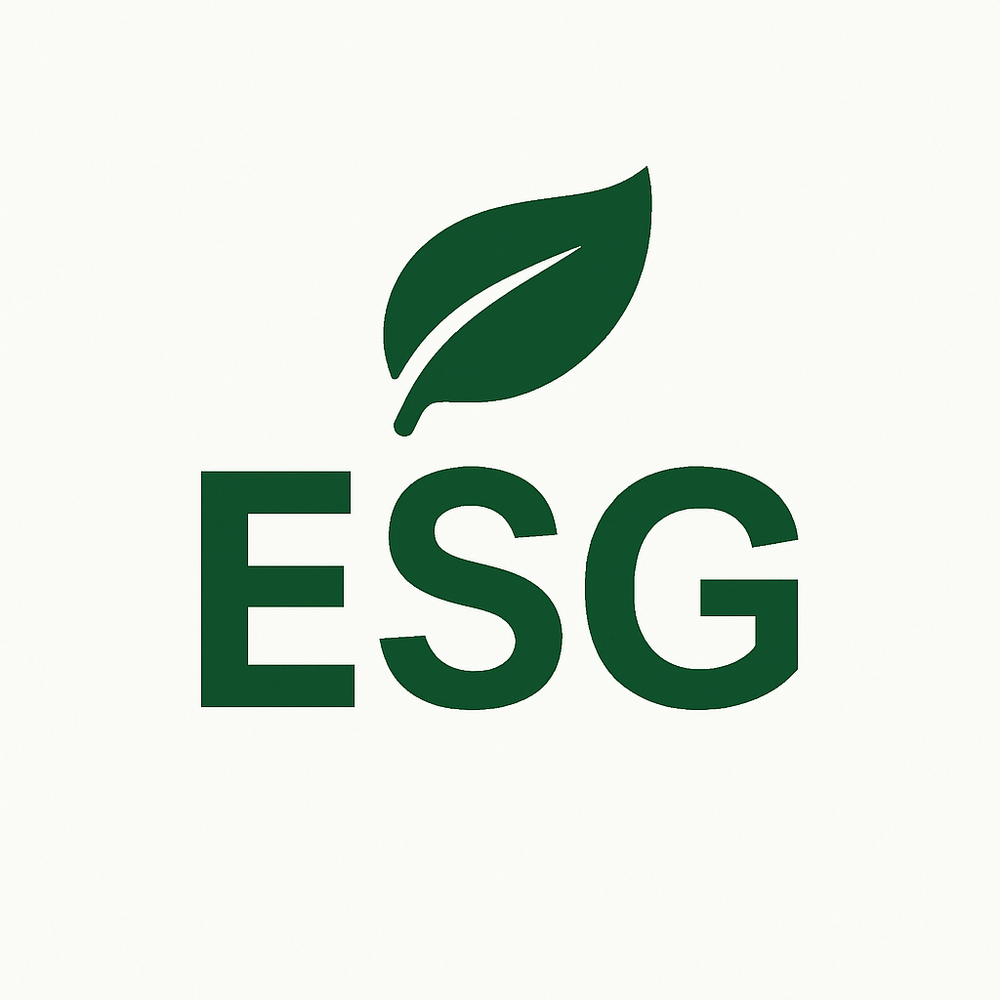

  
  <h1>ESG Analytics Report</h1>
  
  

    <a href="https://lookerstudio.google.com/reporting/4312b149-95c6-41bd-bea9-4d82de7b313d/page/77biE">
    Link to Looker Studio report 
    </a>
  

<!-- Badges -->

  
  
  
  
  
  

   
<h4>
    <a href="https://github.com/billtdavis/ESG_analytics_project/">View Project</a>
   · 
    <a href="https://github.com/billtdavis/ESG_analytics_project/wiki">Documentation</a>
   · 
    <a href="https://github.com/billtdavis/ESG_analytics_project/issues/">Report Bug</a>
   · 
    <a href="https://github.com/billtdavis/ESG_analytics_project/issues/">Request Feature</a>
   · 
    <a href="https://github.com/billtdavis/ESG_analytics_project/issues/">Leave Feedback</a>
  </h4>

 

<!-- Table of Contents -->
# :notebook_with_decorative_cover: Table of Contents

- [:notebook\_with\_decorative\_cover: Table of Contents](#notebook_with_decorative_cover-table-of-contents)
  - [:gem: Acknowledgements](#gem-acknowledgements)
  - [:star2: About the Project](#star2-about-the-project)
  - [:space\_invader: Tech Stack](#space_invader-tech-stack)
  - [:wave: Contributing](#wave-contributing)
  - [:grey\_question: FAQ](#grey_question-faq)
  - [:warning: License](#warning-license)
  - [:handshake: Contact](#handshake-contact)

<!-- Acknowledgments -->
## :gem: Acknowledgements

Use this section to mention useful resources and libraries that you have used in your projects.
 - [README Template](https://github.com/Louis3797/awesome-readme-template)
 - [Shields.io Icons](https://shields.io/)
  

<!-- About the Project -->
## :star2: About the Project
- Origin: This started on a Le Wagon analytics bootcamp as an end-of-course final project.
- Purpose: We wanted to do an end-to-end analytics project where we sourced data, transformed it, analysed it, and presented insights.
- Result: The 

<!-- TechStack -->
## :space_invader: Tech Stack

- Python (Google Colab)
- Google BigQuery (Google Cloud Platform)
- Google Looker Studio
- Version Control/Storage (previous): Google Drive
- Version Control/Storage (current): GitHub

<!-- Contributing -->
## :wave: Contributing

<a href="https://github.com/billtdavis"> billtdavis</a>

<a href="https://github.com/seahunter88"> seahunter88</a>

Alan (anonymised)

Radhika (anonymised)

Contributions are always welcome! I don't have a set framework beyond the GitHub code of conduct but if you have any ideas make a pull request or open an issue!

<!-- FAQ -->
## :grey_question: FAQ

- Question 1

  + Answer 1

- Question 2

  + Answer 2

<!-- License -->
## :warning: License

Distributed under the GNU General Public License v3.0. See LICENSE.txt for more information.

<!-- Contact -->
## :handshake: Contact

[Project Link](https://github.com/billtdavis/ESG_analytics_project)

<a href="https://www.linkedin.com/in/bill-t-davis"> Bill Davis Linkedin</a>

<a href="https://www.linkedin.com/in/sarah-ea-hunter/"> Sarah Hunter Linkedin</a>
